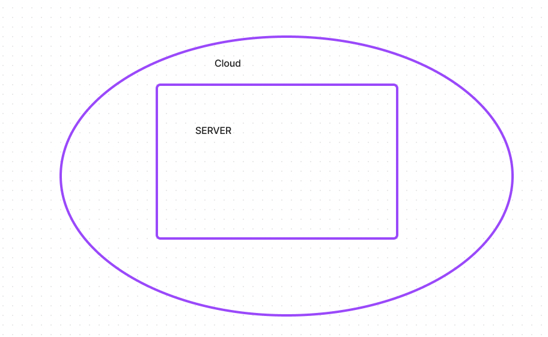

# LAB - Class 16

## Project: AWS Server

### Author:  Malik Sadiki-Torres

### Problem Domain

AWS server deployment

### Process

1. Create user within aws
2. access proper keys
3. follow command line promps
4. create application within aws and follow the prompts
5. input role access where necessary.

### Links and Resources

- [DEV enviornment](http://aws-server-dev.us-east-2.elasticbeanstalk.com/)
- [ENV Deployment](http://aws-server-env.eba-8muntfwy.us-east-2.elasticbeanstalk.com/)

### Collaborators
I referenced the demo video and the lecture md

### Setup

Install:

1. `npm init -y`
2. `npm install express dotenv`
2.  Create `env` file

#### `.env` requirements (where applicable)

Establish port in env

#### How to initialize/run your application (where applicable)

clone repo, `npm i` to install the required dependencies to run this application

#### Routes

Test with aws enviornments

#### Tests
Not applicable

#### UML

